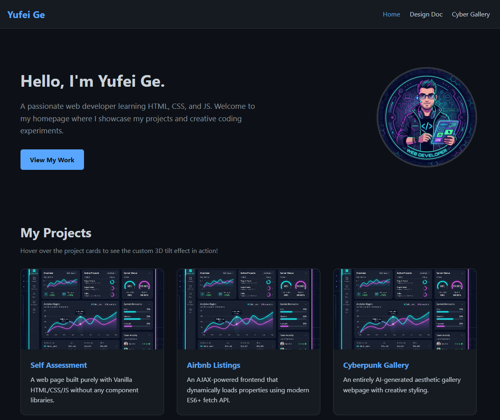

# Project 1: Personal Homepage

## 1. Project Description

This project is a static frontend-only personal homepage built entirely using Vanilla HTML5, CSS3, and ES6+ JavaScript. The goal is to demonstrate a firm grasp of core web technologies without relying on backend logic, external CSS frameworks (like Bootstrap), or JS libraries (like jQuery).

## 2. Author

**Yufei Ge**  
GitHub: [THEO250101](https://github.com/THEO250101)

## 3. Class Link

https://northeastern.instructure.com/courses/249954

## 4. Project Objective

To create a semantic, responsive, and visually appealing web portfolio featuring an interactive JavaScript component implemented using ES6 modules.

## 5. Screenshot



## 6. Instructions to Build / Run Locally

Due to browser security restrictions (CORS) regarding ES6 `type="module"` imports, simply double-clicking `index.html` will result in a console error. You must serve it through a local web server:

**Using Node (npx):**

```bash
npx http-server .
```

Then navigate to `http://127.0.0.1:8080`.

**Using Python:**

```bash
python3 -m http.server
```

Then navigate to `http://localhost:8000`.

## 7. GenAI Tools Usage

To satisfy the rubric requirement ("Describe the use of GenAI tools if any. Provide what models were used, versions, prompts, and how it was used"):

- **Model Used:** Gemini 3.1 Pro (via Antigravity Assistant)
- **Prompts/How it was used:**
  1. I used the AI to help me generate a well-structured boilerplate `package.json` with ESLint and Prettier configurations.
  2. The AI was prompted to help me design the `ai.html` ("Cyberpunk Art Gallery") page, conceptualizing the design system and generating the HTML structure for the AI card grid.
  3. The 3D tilt algorithm (`tilt.js`) math calculations for `rotateX` and `rotateY` based on mouse coordinates were refined using AI assistance to ensure smooth performance without relying on external libraries like `vanilla-tilt.js`.
